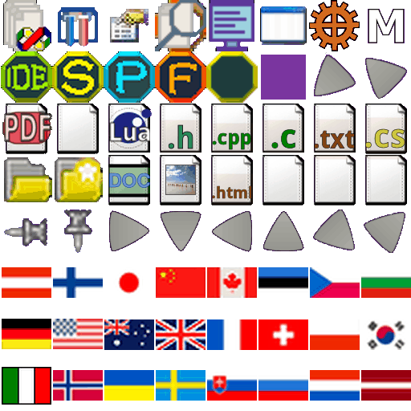

# pngEmbedder
pngEmbedder is the command-line tool I use to embed a **paletted RGBA image** into a C/C++ file.

# HOW TO COMPILE
pngEmbedder.c is a single C89 file that can be easily compiled this way:

```gcc -Os --std=gnu89 -no-pie pngEmbedder.c -o pngEmbedder -lm```

(or in a similar way using other compilers)

# EXAMPLE USAGE
Input image: Tile8x8.png (512x512 pixels)



To reduce the number of colors we use **pngnq** (on Ubuntu: ```sudo apt-get install pngnq```) this way:

```pngnq -n 75 Tile8x8.png```

Paletted Image: Tile8x8-nq8.png (512x512 pixels) 


Now we run:

```./pngEmbedder Tile8x8-nq8.png```

And we get [Tile8x8-nq8.png.inl](./Tile8x8-nq8.png.inl)
Please note that the .inl file is C/C++ compatible and contains at the bottom the **complete** instructions to decode it back to an RGBA array (without using any additional image library).

Once we have the .inl file we can easily load it back and optionally turn it back into a .png image (see [Test/test.c](./Test/test.c))

Inline files are more compact if we can afford using a smaller number of colours in the palette, and a smaller image resolution.

Tip: we can flip the image vertically if we use:

```./pngEmbedder -f Tile8x8-nq8.png```
